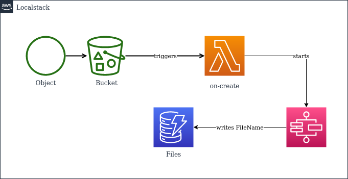

Track a list of files that have been uploaded. For this we require:
- A S3 Bucket to where we upload files
- A DynamoDb table called `Files` with an attribute `FileName`
- A Stepfunction that writes to the DynamoDb table
- A Lambda that get's triggered after a file upload and then executes the stepfunction.

# Usage

## Start localstack

```shell
docker-compose up
```

Watch the logs for `Execution of "preload_services" took 986.95ms`
```

## AWS CLI examples
### S3
```shell
aws --endpoint-url http://localhost:4566 s3 cp README.md s3://tf-assignment-bucket/
```

## StepFunctions
```shell
aws --endpoint-url http://localhost:4566 stepfunctions list-state-machines
```

## DynamoDb

```shell
aws --endpoint-url http://localhost:4566 dynamodb scan --table-name Files
```
